# VISE-D Dashboard – Dokumentation

Diese Dokumentation erläutert Inhalte und Arbeitsweise des VISE-D-Dashboards anhand der
einzelnen Seiten und wird durch Screenshots gestützt. Sie ist als Abschnitt eines
Projektberichts gedacht.

**Stand:** Juni 2026

---

## Inhaltsverzeichnis

- [1. Einleitung](#1-einleitung)
- [2. Datengrundlagen & Modelle](#2-datengrundlagen--modelle)
- [3. Die Seiten im Detail](#3-die-seiten-im-detail)
  - [3.1 Übersicht](#31-übersicht)
    - [Startseite](#startseite)
  - [3.2 Energiesystemanalysen](#32-energiesystemanalysen)
    - [Netzmodell-Szenario](#netzmodell-szenario)
    - [Flexibilitätskonfigurator](#flexibilitätskonfigurator)
  - [3.3 Marktstammdatenregister](#33-marktstammdatenregister)
    - [Solaranlagen](#solaranlagen)
    - [Windanlagen](#windanlagen)
    - [Speicheranlagen](#speicheranlagen)
  - [3.4 Forschungsergebnisse](#34-forschungsergebnisse)
    - [Integration von E-Fahrzeugen in Verteilnetze](#integration-von-e-fahrzeugen-in-verteilnetze)
    - [Flexibilität in Groß- und Verteilnetzen](#flexibilität-in-groß--und-verteilnetzen)
  - [3.5 Lastprofilgeneratoren](#35-lastprofilgeneratoren)
    - [E-Mobilität](#e-mobilität)
    - [Wärmepumpe](#wärmepumpe)
    - [Photovoltaik](#photovoltaik)
    - [Windenergie](#windenergie)
    - [Elektrischer Speicher](#elektrischer-speicher)
    - [Thermischer Speicher](#thermischer-speicher)
- [4. Screenshot-Checkliste](#4-screenshot-checkliste)
- [Anhang: Export nach Word/PDF](#anhang-export-nach-wordpdf)

---

## 1. Einleitung

**VISE-D** („Virtuelles Institut Smart Energy – Smart Data") ist ein interaktives
**Streamlit**-Dashboard zur Energiesystemanalyse deutscher Verteilnetze. Es bündelt die
Simulation dezentraler Erzeuger und Verbraucher (DER) – Photovoltaik, Windenergie,
Batteriespeicher, Wärmepumpe und Elektrofahrzeuge –, die Lastflussrechnung mit
**Pandapower**, den Zugriff auf reale Anlagendaten aus dem **Marktstammdatenregister
(MaStR)** sowie die Modellierung von Lastflexibilität in einer gemeinsamen, web-basierten
Oberfläche.

Diese Dokumentation beschreibt Aufbau und Arbeitsweise des Dashboards Seite für Seite. Sie
richtet sich an fachkundige Leser (Projektpartner, Forschungs- und Anwendungskontext) und
dient als Abschnitt des Projektberichts. Wiederkehrende Grundlagen – die genutzten
Datenquellen und Berechnungsmodelle – sind einmalig in Kapitel 2 zusammengefasst; die
Seitenbeschreibungen in Kapitel 3 verweisen darauf, statt sie zu wiederholen.

**Aufbau der Anwendung.** Das Dashboard ist über eine Seitenleiste navigierbar und in fünf
thematische Gruppen gegliedert:

- **Übersicht** – die *Startseite* als Einstieg mit Kurzbeschreibung aller verfügbaren
  Analysen.
- **Energiesystemanalysen** – die beiden zentralen Werkzeuge *Netzmodell-Szenario*
  (Netzaufbau, DER-Platzierung und Zeitreihen-Lastfluss) und *Flexibilitätskonfigurator*
  (Aggregation und Vergleich von Haushaltsflexibilität).
- **Marktstammdatenregister** – kartenbasierte Auswertung realer *Solar-*, *Wind-* und
  *Speicheranlagen* einer Stadt mit optionaler Erzeugungssimulation.
- **Forschungsergebnisse** – aufbereitete Ergebnisse zu *E-Fahrzeugen in Verteilnetzen* und
  zu *Flexibilität in Groß- und Verteilnetzen*.
- **Lastprofilgeneratoren** – Einzelwerkzeuge zur Profilerzeugung je Technologie:
  *E-Mobilität*, *Wärmepumpe*, *Photovoltaik*, *Windenergie*, *Elektrischer Speicher* und
  *Thermischer Speicher*.

**Technischer Hinweis.** Einstiegspunkt der Anwendung ist `dashboard.py`; es enthält
ausschließlich die Navigation. Jede Seite wird erst beim ersten Aufruf importiert
(Lazy-Loading), damit rechenintensive Bibliotheken wie Pandapower oder die DER-Modelle den
Programmstart nicht verlangsamen.

---

## 2. Datengrundlagen & Modelle

Mehrere Seiten greifen auf dieselben externen Datenquellen und Berechnungsbibliotheken zu.
Sie sind hier einmal zentral beschrieben; die Seitenkapitel verweisen darauf.

**Marktstammdatenregister (MaStR).** Das MaStR ist das amtliche Register aller
Strom- und Gaserzeugungsanlagen in Deutschland. Das Dashboard bezieht daraus reale
Anlagendaten (Standort, Leistung, Typ) und nutzt eine **dreistufige, für den Nutzer
transparente Datenquelle**: (1) Liegt die lokale SQLite-Datenbank `open-mastr.db` vor, kommen
Ortsauswahl und Anlagendaten direkt aus dieser Datenbank. (2) Fehlt die Datenbank, ist aber
die mitgelieferte Ortslisten-CSV vorhanden, stammt die Ortsauswahl aus dieser CSV und die
Anlagendaten werden **live** aus dem öffentlichen MaStR-Online-Register geladen (dann nur
Anlagen „In Betrieb"). (3) Fehlt beides, erfolgt eine Freitexteingabe von Ort oder
Postleitzahl, ebenfalls mit Live-Abruf. Die mehrere Gigabyte große `open-mastr.db` ist nicht
Teil des Repositorys; ausgeliefert werden nur die Ortslisten-CSVs.

**DWD-Wetterdaten.** Witterungsabhängige Simulationen (PV, Wind, Wärmepumpe,
thermischer/elektrischer Speicher) nutzen Messdaten des Deutschen Wetterdienstes (DWD) –
Globalstrahlung, Windgeschwindigkeit und Lufttemperatur. Der Zugriff erfolgt über den in
`vpplib` enthaltenen `DWDClient`; aus den Stationsdaten wird je Standort die nächstgelegene
Station verwendet und das Ergebnis im 15-Minuten-Raster bereitgestellt.

**vpplib.** Die eigentlichen Komponentenmodelle – Photovoltaik, Windenergieanlage,
Elektrofahrzeug (BEV), Wärmepumpe und Batteriespeicher – stammen aus der Bibliothek `vpplib`
(„Virtual Power Plant Library"). Sie kapselt die physikalische Modellierung der einzelnen
Erzeuger und Verbraucher und liefert die Zeitreihen, die das Dashboard weiterverarbeitet.

**Pandapower.** Die netzbezogene Berechnung – die Zeitreihen-Lastflussrechnung im
*Netzmodell-Szenario* – basiert auf `pandapower`. Damit werden für jeden Zeitschritt
Knotenspannungen und Leitungsauslastungen bestimmt und gegen die zulässigen Grenzwerte
geprüft.

---

## 3. Die Seiten im Detail

### 3.1 Übersicht

#### Startseite

*Navigationsgruppe: Übersicht*

**Zweck & Inhalt.** Die Startseite ist der Einstiegspunkt des Dashboards. Sie begrüßt den
Nutzer, fasst den Zweck der Anwendung in einem Satz zusammen und bietet einen nach
Kategorien gegliederten Überblick über alle verfügbaren Seiten – jeweils mit Kurzbeschreibung
und direktem Navigationslink.

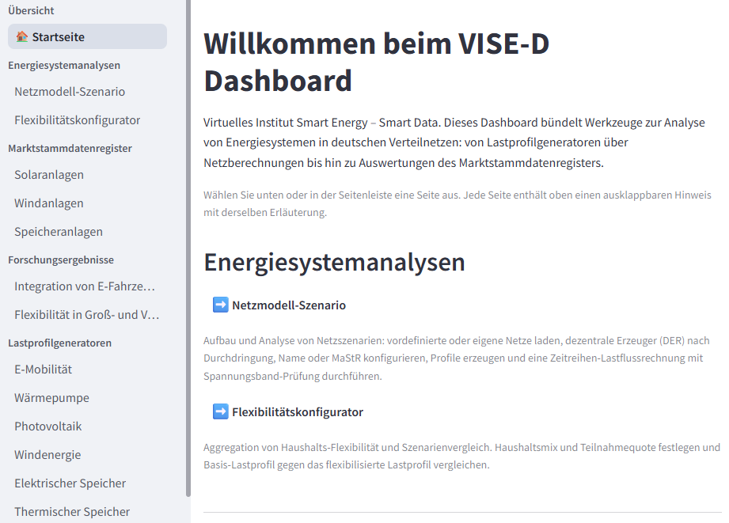

> 📸 **Aufnahme:** Startseite (Landing-Page), Standardzustand direkt nach dem Start des
> Dashboards. Sichtbar: Begrüßungstext sowie die nach Kategorien gruppierten Seiten-Kacheln
> mit Kurzbeschreibung und Navigationslink (➡️).

**Bedienung / Arbeitsweise.** Es sind keine Eingaben nötig. Über die Seitenleiste oder die
Links auf der Startseite gelangt man zu jeder Unterseite. Die Übersicht ist nach den
Kategorien *Energiesystemanalysen*, *Marktstammdatenregister*, *Forschungsergebnisse* und
*Lastprofilgeneratoren* gruppiert; unter jedem Eintrag steht dieselbe Kurzbeschreibung, die
auch oben auf der jeweiligen Unterseite im ausklappbaren Hinweis erscheint.

**Technischer Hintergrund.** Die Seitenbeschreibungen stammen zentral aus
`src/content/page_descriptions.py` (eine Quelle für Startseite und Unterseiten). Die
Navigationsziele werden in `dashboard.py` als `st.Page`-Objekte aufgebaut und über
`st.page_link` verknüpft, sodass die Links direkt zur jeweiligen Seite führen.

**Ergebnis / Ausgabe.** Eine reine Orientierungs- und Navigationsseite ohne Berechnung.

### 3.2 Energiesystemanalysen

#### Netzmodell-Szenario

*Navigationsgruppe: Energiesystemanalysen*

**Zweck & Inhalt.** Das *Netzmodell-Szenario* ist das zentrale Werkzeug des Dashboards. Es
baut ein Verteilnetz auf, platziert dezentrale Erzeuger und Verbraucher (DER) und rechnet
eine **Zeitreihen-Lastflussberechnung** mit Prüfung des Spannungsbands und der
Leitungs- bzw. Transformatorauslastung. Die Seite ist in aufeinander aufbauende Abschnitte
gegliedert: ohne geladenes Netz (Abschnitt 1) bleiben die folgenden Abschnitte gesperrt.

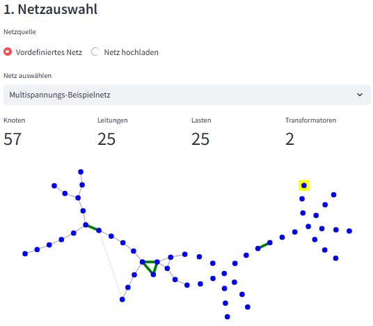

> 📸 **Aufnahme:** Seite „Netzmodell-Szenario", Zustand: ein vordefiniertes Netz ist geladen.
> Sichtbar: Abschnitt „1. Netzauswahl" mit der Netzquelle-Auswahl und der Netz-Vorschau
> darunter.

**Bedienung / Arbeitsweise.** Der Ablauf folgt den nummerierten Abschnitten:

1. **1. Netzauswahl** – Entweder ein *vordefiniertes Netz* aus der Liste wählen oder ein
   eigenes *Netz hochladen* (pandapower JSON/Excel oder CIM/CGMES). Für eigene Netze lässt
   sich eine Excel-Vorlage herunterladen, befüllen und wieder hochladen.
2. **2. Zeitraum** – Start- und Enddatum festlegen; daraus ergibt sich die Zahl der
   Zeitschritte für die Simulation.
3. **3. DER-Konfiguration** – Über drei Reiter werden Anlagen platziert:
   *Szenario (Penetration)* nach Durchdringungsgrad je Technologie, *Gezielt (Namenssuche)*
   an einzelnen Netzknoten oder *MaStR-Anlagen* aus dem Register.
4. **3.5 Profil-Generierung** – In den Reitern *☀️ PV*, *🚗 EV / BEV*, *♨️ Wärmepumpe*,
   *🔋 Speicher* und *📊 Basislast* werden die Zeitreihen für die platzierten Anlagen erzeugt
   (u. a. per DWD-Schnellkonfiguration) oder aus den Konfigurationsseiten übernommen.
5. **4. Simulation & Ergebnisse** – Die Zeitreihensimulation starten.

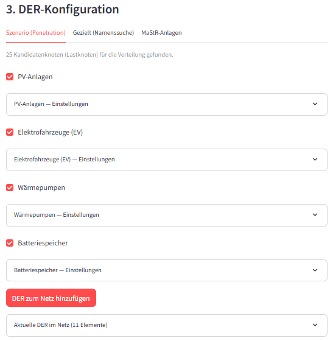

> 📸 **Aufnahme:** Seite „Netzmodell-Szenario", Zustand: Netz geladen, Abschnitt „3.
> DER-Konfiguration" offen. Sichtbar: die Reiter „Szenario (Penetration)", „Gezielt
> (Namenssuche)" und „MaStR-Anlagen" mit den Eingaben zur DER-Platzierung.

**Technischer Hintergrund.** Die Lastflussrechnung basiert auf **Pandapower** (siehe
Kapitel 2); für jeden Zeitschritt werden Knotenspannungen und Auslastungen bestimmt. Die
DER-Profile stammen aus den **vpplib**-Komponentenmodellen, die Anlagendaten wahlweise aus dem
**MaStR**, und witterungsabhängige Profile aus **DWD**-Wetterdaten. Die SimBench-Normlastprofile
liefern die Grundlast.

**Ergebnis / Ausgabe.** Die Auswertung erscheint in drei Reitern – *⚡ Spannungsband*,
*📈 Leitungsauslastung* und *🔌 Transformatorauslastung* – jeweils als Zeitreihen-Diagramm mit
Kennzahlen zu Grenzwertverletzungen (Zielspannungsband 0,9–1,1 p.u.). Zusätzlich lassen sich
die Ergebnisse als Excel exportieren und als PDF-Bericht herunterladen.

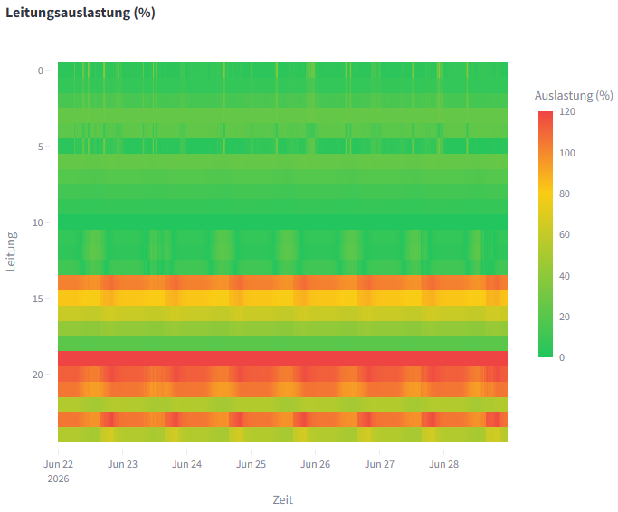

> 📸 **Aufnahme:** Seite „Netzmodell-Szenario" nach „Zeitreihensimulation starten". Sichtbar:
> Reiter „⚡ Spannungsband" (bzw. „📈 Leitungsauslastung") mit dem Zeitreihen-Diagramm und den
> Kennzahlen zu Grenzwertverletzungen.

#### Flexibilitätskonfigurator

*Navigationsgruppe: Energiesystemanalysen*

**Zweck & Inhalt.** Der *Flexibilitätskonfigurator* aggregiert die gerätescharfe
Flexibilität eines Haushaltsmix und vergleicht das Lastprofil **ohne** und **mit**
Lastverschiebung. So wird sichtbar, wie viel Last sich durch flexible Geräte zeitlich
verschieben lässt.

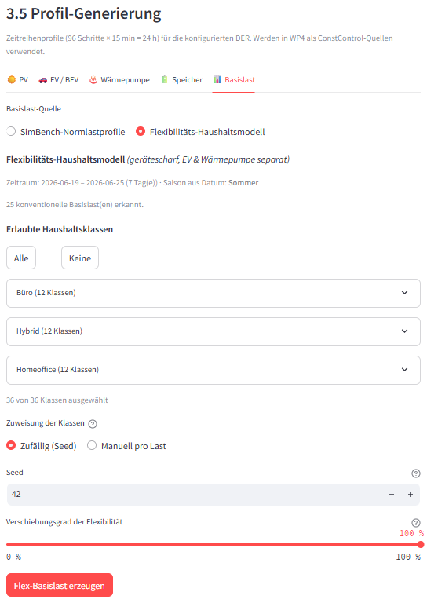

> 📸 **Aufnahme:** Seite „Flexibilitätskonfigurator", Zustand: Zeitraum gewählt und
> Haushaltsmix eingegeben. Sichtbar: Abschnitt „Haushaltsverteilung" mit den
> Haushaltsklassen-Tabellen sowie der Schieberegler für den Verschiebungsgrad (Abschnitt
> „Flexibilität").

**Bedienung / Arbeitsweise.**

1. **Zeitraum** – Start- und Enddatum festlegen. Aus dem Startdatum wird automatisch die
   Jahreszeit abgeleitet (sie bestimmt die verfügbaren Haushaltsklassen); dargestellt wird
   eine repräsentative Woche.
2. **Haushaltsverteilung** – In den nach Arbeitsweise gruppierten Tabellen je Haushaltsklasse
   die Anzahl eintragen.
3. **Flexibilität** – Mit dem Schieberegler den Verschiebungsgrad (0–100 %) wählen.
4. **Berechnen** – „Lastprofil berechnen" klicken.

**Technischer Hintergrund.** Die Last- und Flexibilitätsmodelle stammen aus `src/flexibility/`
und bilden Haushaltsgeräte gerätescharf ab (Elektrofahrzeug und Wärmepumpe separat). Aus der
gewählten Jahreszeit ergeben sich die zulässigen Haushaltsklassen; berechnet und dargestellt
wird jeweils eine repräsentative Woche.

**Ergebnis / Ausgabe.** Ein Liniendiagramm stellt das Basisprofil (durchgezogen) dem
verschobenen Profil (gestrichelt) gegenüber, ergänzt um Kennzahlen (Spitzenlast Basis und
verschoben, verschobene Energie pro Woche). Über „→ Im Netzmodell analysieren" lassen sich die
Profile direkt an die Seite *Netzmodell-Szenario* übergeben.

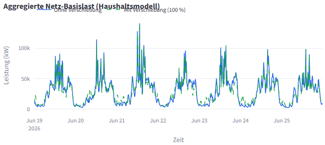

> 📸 **Aufnahme:** Seite „Flexibilitätskonfigurator" nach „Lastprofil berechnen". Sichtbar:
> Liniendiagramm mit Basisprofil (durchgezogen) und verschobenem Profil (gestrichelt) sowie
> die Kennzahlen darunter.

### 3.3 Marktstammdatenregister

#### Solaranlagen

*Navigationsgruppe: Marktstammdatenregister*

**Zweck & Inhalt.** Diese Seite zeigt die Solaranlagen einer Stadt aus dem
Marktstammdatenregister auf einer interaktiven Karte und kann deren Erzeugung optional
simulieren.

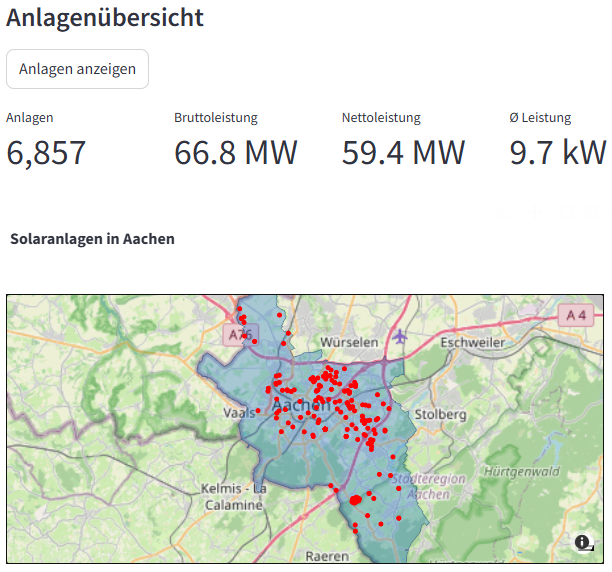

> 📸 **Aufnahme:** Seite „Solaranlagen" nach „Anlagen anzeigen" für eine Stadt. Sichtbar:
> interaktive Karte der Anlagen und die Kennzahlen (Anzahl, Brutto-/Nettoleistung, Ø
> Leistung).

**Bedienung / Arbeitsweise.**

1. **Stadt wählen** – Ort bzw. PLZ im Feld „Stadt" auswählen oder eingeben.
2. **Anlagen anzeigen** – Button „Anlagen anzeigen" klicken: Karte und Kennzahlen erscheinen;
   unter „Detaillierte Statistiken" finden sich ein Leistungs-Histogramm, die 10 größten
   Anlagen und ein CSV-Export.
3. **Erzeugung simulieren (optional)** – Im Abschnitt „Erzeugungssimulation" einen Zeitraum
   setzen und „Erzeugung berechnen" klicken.

**Technischer Hintergrund.** Standort- und Anlagendaten stammen aus dem **MaStR** (lokale DB
oder Live-Online-Register, siehe Kapitel 2). Die optionale Erzeugungssimulation kombiniert die
MaStR-Anlagendaten mit **DWD**-Solarstrahlung und berechnet die Einspeisung im
15-Minuten-Raster.

**Ergebnis / Ausgabe.** Kennzahlen (PV-Systeme, installierte Leistung, Spitzenleistung), ein
Liniendiagramm der aggregierten Solareinspeisung sowie CSV-Downloads (aggregierte und einzelne
Systemzeitreihen).

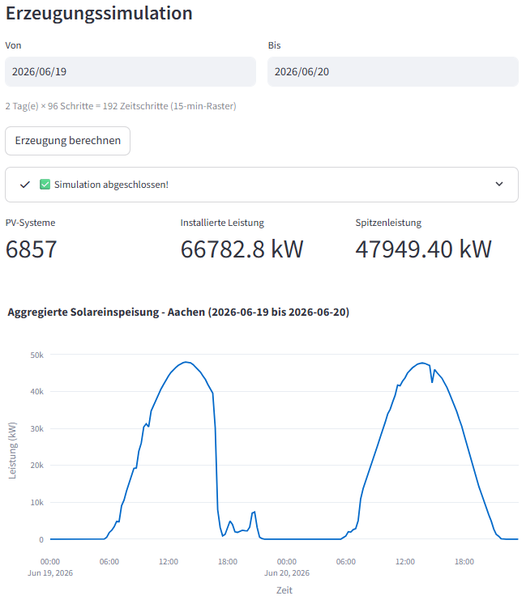

> 📸 **Aufnahme:** Seite „Solaranlagen" nach „Erzeugung berechnen". Sichtbar: Liniendiagramm
> der aggregierten Solareinspeisung mit den zugehörigen Kennzahlen.

#### Windanlagen

*Navigationsgruppe: Marktstammdatenregister*

**Zweck & Inhalt.** Diese Seite zeigt die Windanlagen einer Stadt aus dem
Marktstammdatenregister auf einer interaktiven Karte und kann deren Erzeugung optional
simulieren. Der Aufbau entspricht der Seite *Solaranlagen*.

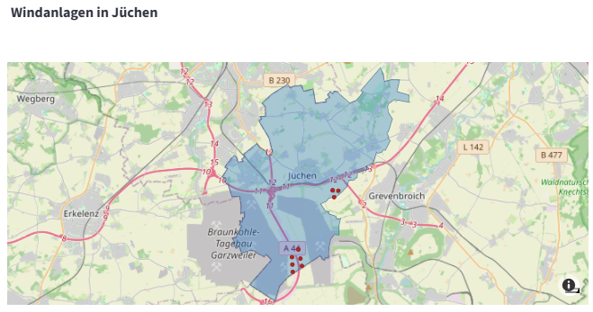

> 📸 **Aufnahme:** Seite „Windanlagen" nach „Anlagen anzeigen" für eine Stadt. Sichtbar:
> interaktive Karte der Anlagen und die Kennzahlen (Anzahl, Brutto-/Nettoleistung, Ø
> Leistung).

**Bedienung / Arbeitsweise.**

1. **Stadt wählen** – Ort bzw. PLZ im Feld „Stadt" auswählen oder eingeben.
2. **Anlagen anzeigen** – Button „Anlagen anzeigen" klicken: Karte und Kennzahlen erscheinen;
   unter „Detaillierte Statistiken" gibt es ein Leistungs-Histogramm, die 10 größten Anlagen
   und einen CSV-Export.
3. **Erzeugung simulieren (optional)** – Im Abschnitt „Erzeugungssimulation" einen Zeitraum
   setzen und „Erzeugung berechnen" klicken (analog zur Seite *Solaranlagen*).

**Technischer Hintergrund.** Die Anlagendaten stammen aus dem **MaStR** (siehe Kapitel 2). Für
die optionale Simulation werden die Turbinentypen abgeglichen, **DWD**-Winddaten geladen und
die Einspeisung im 15-Minuten-Raster berechnet.

**Ergebnis / Ausgabe.** Kennzahlen (Windturbinen, installierte Leistung, Spitzenleistung), ein
Liniendiagramm der aggregierten Windeinspeisung sowie CSV-Downloads (aggregierte und einzelne
Turbinenzeitreihen).

#### Speicheranlagen

*Navigationsgruppe: Marktstammdatenregister*

**Zweck & Inhalt.** Diese Seite zeigt die Speicheranlagen einer Stadt aus dem
Marktstammdatenregister als Karte, Tabelle und Auswertungen. Sie enthält **keine** Simulation.

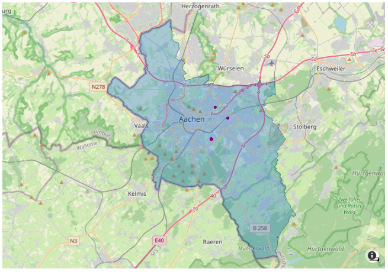

> 📸 **Aufnahme:** Seite „Speicheranlagen" nach „Anlagen anzeigen" für eine Stadt. Sichtbar:
> Karte und Datentabelle der Anlagen sowie die Auswertungen (Tortendiagramm nach
> Betriebsstatus, Balkendiagramm nach Leistungsklassen).

**Bedienung / Arbeitsweise.**

1. **Stadt wählen** – Ort bzw. PLZ im Feld „Stadt" auswählen oder eingeben.
2. **Anlagen anzeigen** – Button „Anlagen anzeigen" klicken.

**Technischer Hintergrund.** Die Standort- und Anlagendaten stammen aus dem **MaStR** (siehe
Kapitel 2). Es findet keine zeitreihenbasierte Erzeugungssimulation statt; ausgewertet werden
ausschließlich die Registerdaten.

**Ergebnis / Ausgabe.** Eine interaktive Karte der Speicheranlagen, eine Datentabelle (Name,
Brutto-/Nettoleistung, Koordinaten, Ort), ein Tortendiagramm nach Betriebsstatus und ein
Balkendiagramm der Anlagen je Nettoleistungsklasse (< 50, 50–200, 200–1000, > 1000 kW).

### 3.4 Forschungsergebnisse

#### Integration von E-Fahrzeugen in Verteilnetze

*Navigationsgruppe: Forschungsergebnisse*

**Zweck & Inhalt.** Eine reine Informationsseite ohne Eingaben. Sie fasst
Forschungsergebnisse zur Integration von Elektrofahrzeugen in Verteilnetze zusammen:
Wie wirken sich verschiedene Tarifmodelle (Festtarif, Time-of-Use, Real-Time) und
DSO-Eingriffsstrategien auf das optimierte Laden, den Flexibilitätsbedarf und die Stromkosten
aus?

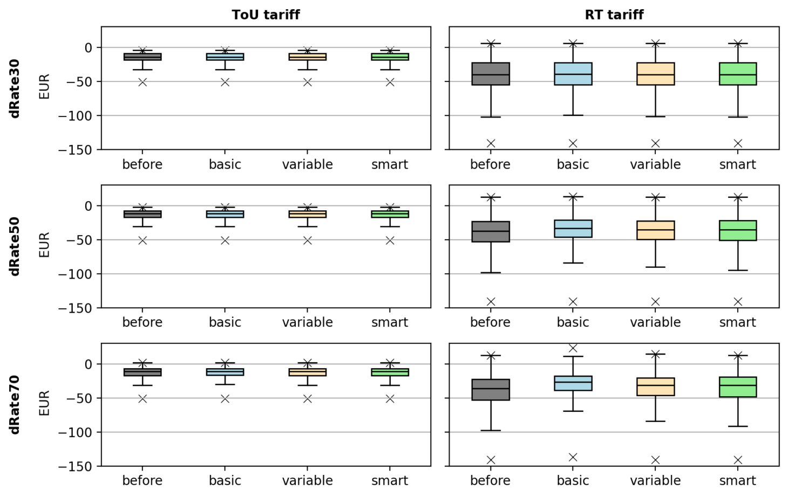

> 📸 **Aufnahme:** Seite „Integration von E-Fahrzeugen in Verteilnetze". Sichtbar: eine der
> Ergebnis-Abbildungen (z. B. „Wirtschaftliche Auswirkungen unterschiedlicher
> Tarifstrukturen") mit dem erläuternden Text darunter.

**Bedienung / Arbeitsweise.** Die Seite wird gelesen, nicht bedient. Auf eine **Kurzfassung**
folgen vier bebilderte Abschnitte: *Großhandels- und Verbraucherpreise* (Festtarif vs. ToU),
*Wirtschaftliche Auswirkungen unterschiedlicher Tarifstrukturen*, *Flexibilität durch
Elektrofahrzeuge* und *Vergleich der Kostendeltas*. Der Text unter jeder Abbildung erläutert
deren Aussage.

**Technischer Hintergrund.** Die Abbildungen sind mit dem Repository ausgelieferte Renderings
der Studienergebnisse; es findet auf dieser Seite keine eigene Berechnung statt. Die
vollständige Publikation ist über den Link in der Kurzfassung erreichbar (englischsprachig).

**Ergebnis / Ausgabe.** Ein verständlicher Überblick über die Studienergebnisse als
Grundlage für die Einordnung der übrigen Analyse-Werkzeuge.

#### Flexibilität in Groß- und Verteilnetzen

*Navigationsgruppe: Forschungsergebnisse*

**Zweck & Inhalt.** Ebenfalls eine reine Informationsseite. Sie stellt die Studie
*„Flexibility in Electricity Wholesale Markets and Distribution Grids"* (Lilienkamp,
Namockel, Ruhnau, EWI Universität zu Köln) vor und gibt deren Ergebnisse zu Netzausbaukosten
durch flexibles Laden von Elektrofahrzeugen wieder. Kernaussage: Unkoordinierte Flexibilität
verschärft Engpässe im Verteilnetz, während lokale Koordination Engpässe deutlich
kostengünstiger behebt als ein Netzausbau.

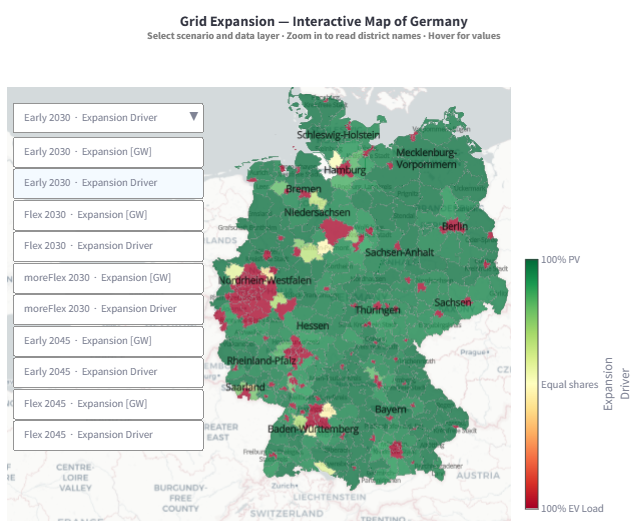

> 📸 **Aufnahme:** Seite „Flexibilität in Groß- und Verteilnetzen", Abschnitt „Interaktive
> Netzausbaukarte". Sichtbar: die interaktive Deutschlandkarte (NUTS3-Kreise) mit dem Dropdown
> zur Szenario-/Ebenen-Auswahl („Netzausbau [GW]" bzw. „Ausbautreiber").

**Bedienung / Arbeitsweise.** Die Seite wird von oben nach unten gelesen: *Zusammenfassung*,
*Zentrale Erkenntnisse*, *Ergebnisse* (Balkendiagramme zu System- und Netzausbaukosten),
*Praktische Implikationen*, *Geografische Verteilung* (Choroplethenkarten nach NUTS3-Kreis),
die *Interaktive Netzausbaukarte* und das *Fazit*. In der interaktiven Karte lässt sich über
ein Dropdown zwischen fünf Szenarien sowie den Ebenen „Netzausbau [GW]" und „Ausbautreiber
(Anteil PV vs. E-Fahrzeuge)" umschalten; per Maus-Hover, Zoom und Verschieben werden Details
und Regionen erkundet.

**Technischer Hintergrund.** Die statischen Abbildungen sind mit dem Repository ausgelieferte
Renderings; die interaktive Karte wird aus einer mitgelieferten Plotly-JSON geladen (plattform-
unabhängig als UTF-8, mit cp1252 als Fallback für ältere Exporte). Auf dieser Seite findet
keine eigene Berechnung statt; die Publikation ist über den Link im Seitenkopf erreichbar.

**Ergebnis / Ausgabe.** Ein Verständnis des Zusammenhangs von dezentraler Flexibilität,
Verteilnetz-Engpässen und Netzausbaukosten – einschließlich der räumlichen Verteilung des
Ausbaubedarfs über Deutschland.

### 3.5 Lastprofilgeneratoren

#### E-Mobilität

*Navigationsgruppe: Lastprofilgeneratoren*

**Zweck & Inhalt.** Diese Seite konfiguriert ein Elektrofahrzeug (BEV) und erzeugt das
zugehörige Lade-Lastprofil.

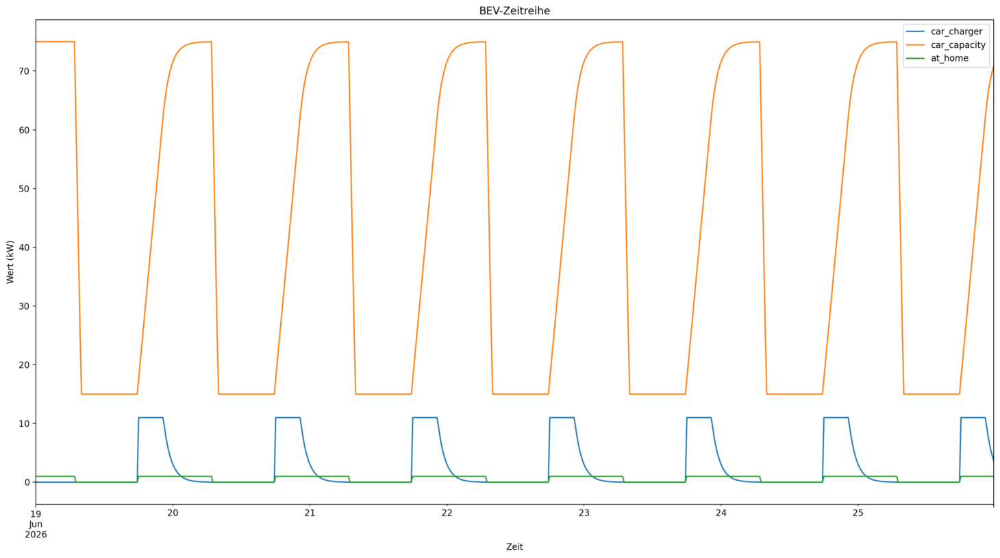

> 📸 **Aufnahme:** Seite „E-Mobilität" nach „BEV simulieren". Sichtbar: das Diagramm der
> Ladeleistung (kW) über die Zeit, das die Ladefenster erkennbar macht (ggf. mit dem
> Eingabeformular darüber).

**Bedienung / Arbeitsweise.**

1. **Fahrzeug konfigurieren** – Batteriekapazität (max./min.), Tagesverbrauch, Ladeleistung,
   Wirkungsgrad sowie An-/Absteckzeiten festlegen.
2. **Zeitraum wählen** – Start-/Enddatum setzen (15-Minuten-Raster).
3. **Simulieren** – „BEV simulieren" klicken.

**Technischer Hintergrund.** Die Lade- und Batteriemodellierung stammt aus dem
**vpplib**-BEV-Modell (siehe Kapitel 2). Es werden keine Wetterdaten benötigt; das Profil
ergibt sich aus Verbrauch, Ladeleistung und den Steckzeiten.

**Ergebnis / Ausgabe.** Eine Vorschau der Zeitreihendaten und ein Diagramm der Ladeleistung
(kW) über die Zeit.

#### Wärmepumpe

*Navigationsgruppe: Lastprofilgeneratoren*

**Zweck & Inhalt.** Diese Seite konfiguriert eine Wärmepumpe und simuliert ihren Betrieb auf
Basis von DWD-Wetterdaten und dem Wärmebedarf des Gebäudes.

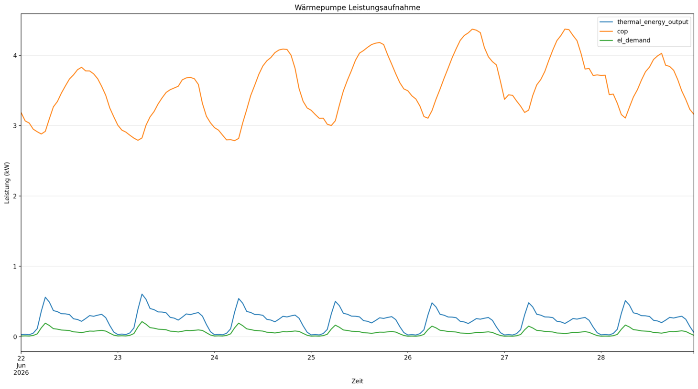

> 📸 **Aufnahme:** Seite „Wärmepumpe" nach „🚀 Wärmepumpe Simulation starten". Sichtbar: die
> Kennzahlen (Gesamtverbrauch, max. Leistung, Ø COP) sowie das Diagramm der Leistungsaufnahme
> bzw. des COP-Verlaufs.

**Bedienung / Arbeitsweise.**

1. **Standort wählen** – Stadtnamen eingeben (Koordinaten per Geocoding).
2. **Zeitraum wählen** – Start-/Enddatum setzen.
3. **Wärmepumpe parametrieren** – Pumpentyp, elektrische/thermische Leistung und
   Systemtemperatur wählen; unter „Gebäude und Wärmebedarf" Jahreswärmebedarf, Gebäudetyp und
   Heizgrenztemperatur festlegen.
4. **Simulieren** – „🚀 Wärmepumpe Simulation starten" klicken.

**Technischer Hintergrund.** Das Wärmepumpenmodell stammt aus **vpplib**; der Betrieb wird
gegen den aus **DWD**-Temperaturen abgeleiteten Wärmebedarf gerechnet (siehe Kapitel 2). Die
genutzte DWD-Station und ihre Entfernung werden unter „Wetterdaten-Information" ausgewiesen.

**Ergebnis / Ausgabe.** Kennzahlen (Gesamtverbrauch, max. Leistung, Ø COP), der COP-Verlauf,
eine Zeitreihen-Vorschau und ein Diagramm der Leistungsaufnahme.

#### Photovoltaik

*Navigationsgruppe: Lastprofilgeneratoren*

**Zweck & Inhalt.** Diese Seite erzeugt ein normiertes PV-Einspeiseprofil auf Basis von
DWD-Wetterdaten – wahlweise für einen frei gewählten Standort oder für reale MaStR-Anlagen.

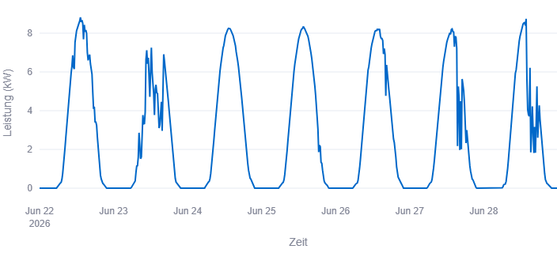

> 📸 **Aufnahme:** Seite „Photovoltaik" nach „Profil generieren". Sichtbar: die Modus-Auswahl
> (standort-/anlagenbasiert) und das Liniendiagramm der PV-Leistung (kW) mit den Kennzahlen.

**Bedienung / Arbeitsweise.**

1. **Modus wählen** – „Standortbasierte Simulation" oder „Anlagenbasierte Simulation".
2. **Standort/Anlagen festlegen** – *Standortbasiert:* Stadtnamen eingeben und installierte
   Leistung in kWp angeben. *Anlagenbasiert:* Stadt wählen, optional über das Namensfeld
   filtern und Anlagen in der Mehrfachauswahl markieren.
3. **Zeitraum wählen** – Start-/Enddatum setzen (15-Minuten-Raster).
4. **Profil generieren** – Button „Profil generieren" klicken.

**Technischer Hintergrund.** Berechnet wird auf Basis eines 1-kWp-Referenzsystems aus
**vpplib**, das auf die angegebene Leistung skaliert wird; die Globalstrahlung kommt vom
**DWD** (siehe Kapitel 2). Anlagenbezogene Daten stammen aus dem **MaStR**.

**Ergebnis / Ausgabe.** Liniendiagramm der PV-Leistung (kW) samt Kennzahlen (Spitzenleistung,
Energie, Kapazitätsfaktor). Bei mehreren Anlagen je Anlage ein Reiter plus ein aggregierter
Gesamt-Reiter; Profile als CSV herunterladbar.

#### Windenergie

*Navigationsgruppe: Lastprofilgeneratoren*

**Zweck & Inhalt.** Diese Seite erzeugt ein Windeinspeiseprofil aus DWD-Winddaten (10 m) mit
Nabenhöhen-Korrektur über den Hellman-Exponenten – standort- oder anlagenbasiert (MaStR).

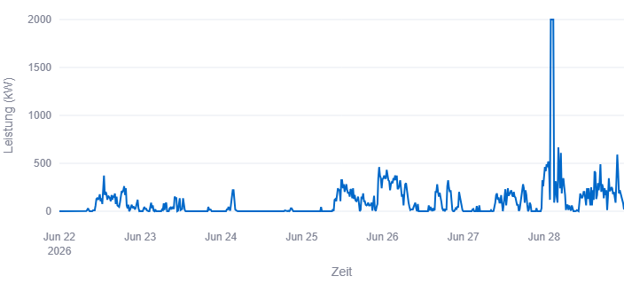

> 📸 **Aufnahme:** Seite „Windenergie" nach „Profil generieren". Sichtbar: das Liniendiagramm
> der Windleistung (kW) mit den Kennzahlen (Spitzenleistung, Energie, Kapazitätsfaktor).

**Bedienung / Arbeitsweise.**

1. **Modus wählen** – „Standortbasierte Simulation" oder „Anlagenbasierte Simulation".
2. **Standort/Anlagen festlegen** – *Standortbasiert:* Stadtnamen, Nabenhöhe (m) und
   Nennleistung (kW) angeben. *Anlagenbasiert:* Stadt wählen, optional über das Namensfeld
   (Anlagen- oder Windparkname) filtern und Anlagen markieren.
3. **Hellman-Exponent setzen** – Geländerauigkeit wählen (0,10 = Küste/Offshore · 0,20 =
   offenes Gelände · 0,30–0,40 = Wald/Bebauung).
4. **Zeitraum wählen** – Start-/Enddatum setzen.
5. **Profil generieren** – Button „Profil generieren" klicken.

**Technischer Hintergrund.** Das Windmodell stammt aus **vpplib**; die Windgeschwindigkeit in
10 m kommt vom **DWD** und wird über den Hellman-Exponenten auf die Nabenhöhe extrapoliert
(siehe Kapitel 2). Anlagendaten stammen aus dem **MaStR**.

**Ergebnis / Ausgabe.** Liniendiagramm der Windleistung (kW) samt Kennzahlen. Bei mehreren
Anlagen je Anlage ein Reiter plus ein aggregierter Gesamt-Reiter; Profile als CSV
herunterladbar.

#### Elektrischer Speicher

*Navigationsgruppe: Lastprofilgeneratoren*

**Zweck & Inhalt.** Diese Seite konfiguriert einen Batteriespeicher und simuliert seinen
Betrieb im Zusammenspiel mit PV-Erzeugung und einer konstanten Grundlast.

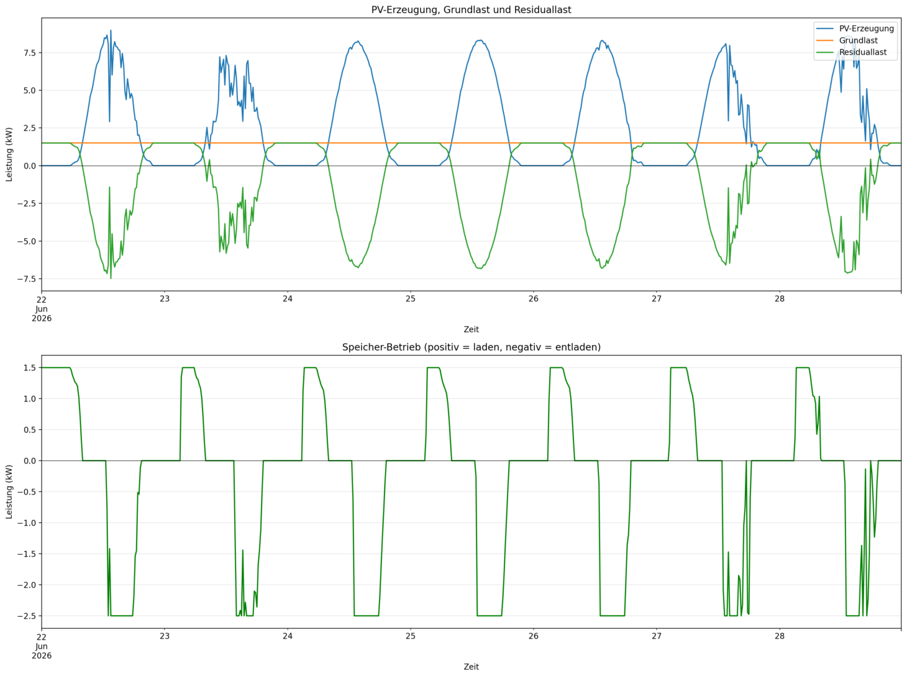

> 📸 **Aufnahme:** Seite „Elektrischer Speicher" nach „🚀 Speicher Simulation starten".
> Sichtbar: das Diagramm des Speicherbetriebs (positiv = laden, negativ = entladen) bzw. die
> PV-/Grundlast-/Residuallast-Darstellung mit den Kennzahlen.

**Bedienung / Arbeitsweise.**

1. **Standort wählen** – Stadtnamen eingeben.
2. **Zeitraum wählen** – Start-/Enddatum setzen.
3. **Speicher parametrieren** – Kapazität, max. Leistung, Lade-/Entladewirkungsgrad und C-Rate
   festlegen; unter „Lastprofil Einstellungen" die Grundlast (kW) angeben.
4. **Simulieren** – „🚀 Speicher Simulation starten" klicken.

**Technischer Hintergrund.** Das Speichermodell stammt aus **vpplib** (siehe Kapitel 2). Die
Simulation benötigt ein zuvor auf der Seite *Photovoltaik* konfiguriertes PV-System – ohne
PV-System lässt sie sich nicht ausführen.

**Ergebnis / Ausgabe.** Kennzahlen (geladen, entladen, max. Leistung), eine Energiebilanz mit
Eigenverbrauchsanteil, eine Datenvorschau sowie zwei Diagramme (PV/Grundlast/Residuallast
sowie Speicherbetrieb).

#### Thermischer Speicher

*Navigationsgruppe: Lastprofilgeneratoren*

**Zweck & Inhalt.** Diese Seite konfiguriert einen thermischen Speicher (Warmwasserspeicher)
und simuliert seine Beladung durch eine Wärmepumpe gegen den wetterabhängigen Wärmebedarf.

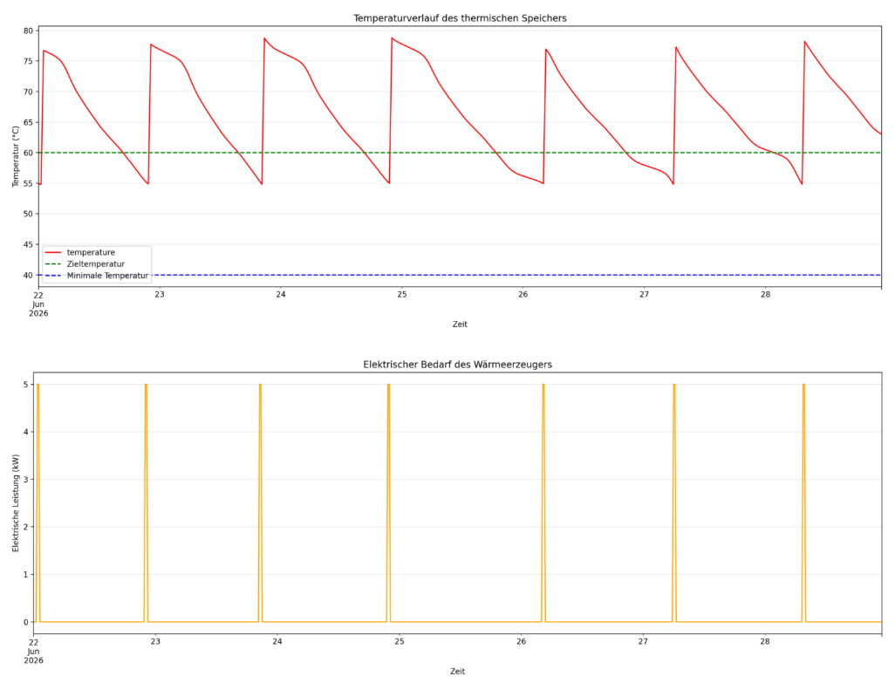

> 📸 **Aufnahme:** Seite „Thermischer Speicher" nach „Thermischen Speicher simulieren".
> Sichtbar: das Diagramm des Temperaturverlaufs (mit Ziel- und Minimaltemperatur) bzw. des
> elektrischen Bedarfs des Wärmeerzeugers.

**Bedienung / Arbeitsweise.**

1. **Standort wählen** – Stadtnamen eingeben.
2. **Zeitraum wählen** – Start-/Enddatum setzen.
3. **Gebäude & Wärmebedarf** – Jahreswärmebedarf, Gebäudetyp und Heizgrenztemperatur festlegen
   (daraus wird der Wärmebedarf über ein Referenzjahr kalibriert).
4. **Speicher parametrieren** – Ziel-/Minimaltemperatur, Hysterese, Masse, Wärmekapazität und
   Tagesverlust eingeben und „Einstellungen speichern".
5. **Wärmeerzeuger parametrieren** – Unter „Wärmeerzeuger (Wärmepumpe)" Typ, Vorlauftemperatur
   sowie elektrische/thermische Leistung festlegen und „Einstellungen speichern".
6. **Simulieren** – „Thermischen Speicher simulieren" klicken.

**Technischer Hintergrund.** Wärmepumpe und Speicher stammen aus **vpplib** und werden
gekoppelt betrieben; der Wärmebedarf wird aus **DWD**-Temperaturen über ein Referenzjahr
kalibriert (siehe Kapitel 2).

**Ergebnis / Ausgabe.** Vorschau-Tabellen sowie Diagramme des Temperaturverlaufs (mit Ziel-
und Minimaltemperatur) und des elektrischen Bedarfs des Wärmeerzeugers. Bei Unterdeckung
erscheint ein Hinweis mit Lösungsvorschlägen.

---

## 4. Screenshot-Checkliste

Alle benötigten Aufnahmen in Dokumentreihenfolge. Die Dateien in `docs/project/screenshots/`
ablegen; die Dateinamen müssen exakt mit den Platzhaltern oben übereinstimmen.

- [ ] `startseite-01-uebersicht.png` — Startseite: Begrüßung + gruppierte Seiten-Kacheln.
- [ ] `netzmodell-01-netzauswahl.png` — Netzmodell-Szenario: Abschnitt 1 Netzauswahl + Netz-Vorschau (Netz geladen).
- [ ] `netzmodell-02-der-konfiguration.png` — Netzmodell-Szenario: Abschnitt 3 DER-Konfiguration mit den drei Reitern.
- [ ] `netzmodell-03-ergebnis.png` — Netzmodell-Szenario: Ergebnis-Reiter „⚡ Spannungsband" / „📈 Leitungsauslastung" nach Simulation.
- [ ] `flexibility-01-haushaltsmix.png` — Flexibilitätskonfigurator: Haushaltsverteilung + Schieberegler Verschiebungsgrad.
- [ ] `flexibility-02-vergleich.png` — Flexibilitätskonfigurator: Vergleichsdiagramm Basis vs. verschoben + Kennzahlen.
- [ ] `solar-mastr-01-karte.png` — Solaranlagen: interaktive Karte + Kennzahlen (nach „Anlagen anzeigen").
- [ ] `solar-mastr-02-erzeugung.png` — Solaranlagen: Diagramm der aggregierten Solareinspeisung (nach „Erzeugung berechnen").
- [ ] `wind-mastr-01-karte.png` — Windanlagen: interaktive Karte + Kennzahlen (nach „Anlagen anzeigen").
- [ ] `storage-mastr-01-karte.png` — Speicheranlagen: Karte + Tabelle/Auswertungen (nach „Anlagen anzeigen").
- [ ] `research-ev-01-abbildung.png` — Integration von E-Fahrzeugen: eine Ergebnis-Abbildung mit Erläuterungstext.
- [ ] `grid-expansion-01-karte.png` — Flexibilität in Groß- und Verteilnetzen: interaktive Netzausbaukarte mit Szenario-Dropdown.
- [ ] `bev-01-ladeprofil.png` — E-Mobilität: Diagramm der Ladeleistung (kW) über die Zeit (nach „BEV simulieren").
- [ ] `heatpump-01-ergebnis.png` — Wärmepumpe: Kennzahlen + Leistungs-/COP-Diagramm (nach Simulation).
- [ ] `pv-01-profil.png` — Photovoltaik: Modus-Auswahl + PV-Leistungsdiagramm (nach „Profil generieren").
- [ ] `wind-01-profil.png` — Windenergie: Windleistungsdiagramm + Kennzahlen (nach „Profil generieren").
- [ ] `electrical-storage-01-speicherbetrieb.png` — Elektrischer Speicher: Diagramm Speicherbetrieb (laden/entladen) nach Simulation.
- [ ] `thermal-storage-01-temperaturverlauf.png` — Thermischer Speicher: Temperaturverlauf-Diagramm (nach Simulation).

---

## Anhang: Export nach Word/PDF

Diese Datei ist die Quelle (Single Source of Truth). Für die Abgabe im Projektbericht lässt sie
sich mit [Pandoc](https://pandoc.org/) konvertieren, z. B.:

```bash
# im Ordner docs/project/ ausführen, damit die relativen Screenshot-Pfade stimmen
pandoc dashboard-dokumentation.md -o dashboard-dokumentation.docx
pandoc dashboard-dokumentation.md -o dashboard-dokumentation.pdf
```

Die Screenshots werden über relative Pfade (`screenshots/…`) eingebunden; der Ordner
`docs/project/screenshots/` muss also neben der Markdown-Datei liegen. Für die PDF-Ausgabe wird
eine LaTeX-Engine benötigt (z. B. `--pdf-engine=xelatex`, das Umlaute zuverlässig setzt).
